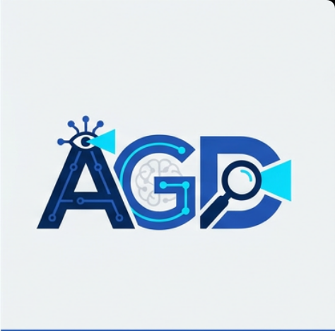
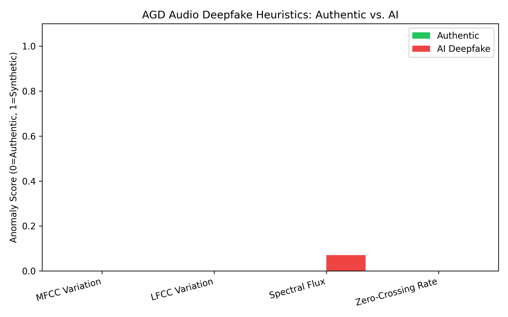
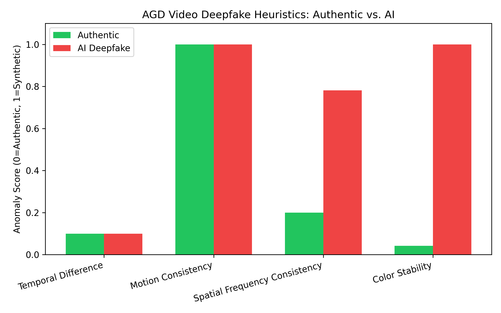

# Artificial General Detector

<div align="center">



**Multi-modal forensic framework for identifying AI-generated content.**  
Text · Image · Audio · Video — 27 independent detection techniques, full interpretability.

[](LICENSE)
[](https://python.org)
[](https://fastapi.tiangolo.com)
[](https://github.com/Ardelyo)

<a href="https://www.producthunt.com/posts/artificial-general-detector?utm_source=badge-featured&utm_medium=badge&utm_souce=badge-artificial-general-detector" target="_blank">
  
</a>

</div>

---

## Overview

AGD is an open-source forensic detection engine that identifies AI-generated content through an ensemble of **27 independent techniques** across four modalities. Unlike single-model classifiers that produce an opaque probability score, AGD generates a full **anomaly map** — each technique returns a named, interpretable signal so human auditors understand *why* content is flagged, not merely *that* it is.

The system is built on a principle of adversarial resilience: an evasion technique that defeats one detector leaves 26 others active.

<p align="center">
  
  <br/>
  <sub>Figure 1. AGD multi-modal detection pipeline</sub>
</p>

---

## Architecture

The Orchestrator API routes input by MIME type to specialized sub-modules. Each module runs its technique suite independently, then returns per-technique scores to a weighted ensemble layer that produces the master score and confidence calibration.

```
Input (Text / Image / Audio / Video)
          │
          ▼
  ┌───────────────────┐
  │   Orchestrator    │   FastAPI gateway, MIME routing
  └────────┬──────────┘
           │
   ┌───────┼───────────────┬──────────┐
   ▼       ▼               ▼          ▼
agd-text  agd-image    agd-audio  agd-video
12 tech   15 tech       4 tech     4 tech
   │       │               │          │
   └───────┴───────────────┴──────────┘
                     │
          ┌──────────▼──────────┐
          │   Weighted Ensemble  │
          │  + Confidence Score  │
          └──────────┬──────────┘
                     │
              Forensic Report
```

---

## Detection Techniques

### Image Forensics — 15 Techniques

Pixel-level, frequency-domain, and statistical analysis to detect synthetic image artifacts.

| # | Technique | Signal |
|---|-----------|--------|
| 1 | Pixel-Level ELA | JPEG recompression error differentials |
| 2 | JPEG Ghost Detection | Multi-quality recompression profiling |
| 3 | SRM Multi-Kernel (5 filters) | Camera sensor noise vs. synthetic noise |
| 4 | DCT Blockwise Analysis | 8×8 block coefficient uniformity |
| 5 | FFT Radial Power Spectrum | GAN spectral spikes / diffusion rolloff |
| 6 | High-Frequency Energy Ratio | Over-smoothing detection |
| 7 | Color Coherence | Inter-channel correlation anomalies |
| 8 | Edge Sharpness (Sobel) | Gradient distribution irregularities |
| 9 | Noise Floor Variance | Spatially uniform noise (synthetic) |
| 10 | Patch-Grid Homogeneity | Local feature uniformity across blocks |
| 11 | Chromatic Aberration Test | Missing lens dispersion effects |
| 12 | Bit-Plane Analysis | LSB entropy patterns |
| 13 | Histogram Gap Detection | Unnatural intensity quantization |
| 14 | Texture Complexity (LBP) | Local Binary Pattern diversity |
| 15 | Global Statistical Fingerprint | Per-channel skewness and kurtosis |

<p align="center">
  
  <br/>
  <sub>Figure 2. Error Level Analysis — authentic photograph (varied response) vs. AI-generated image (uniform response)</sub>
</p>

### Text Forensics — 12 Techniques

Token-level and document-level analysis to identify machine-generated prose.

| # | Technique | Signal |
|---|-----------|--------|
| 1 | Token-by-Token Perplexity | RoBERTa log-probability per 50-token chunk |
| 2 | Sentence-Level RoBERTa | Per-sentence AI probability score |
| 3 | Sliding-Window Entropy | Vocabulary diversity variation |
| 4 | Burstiness Profile | Sentence length regularity (CV, skew, kurtosis) |
| 5 | N-Gram Repetition Heatmap | Bigram / trigram / quadgram overlap |
| 6 | Vocabulary Fingerprinting | Zipf's law deviation, type-token ratio |
| 7 | Stylometric Features | Word length, punctuation density, case ratios |
| 8 | Perplexity Proxy | Word frequency rank distribution |
| 9 | Positional Entropy | Entropy variation across document sections |
| 10 | Function Word Analysis | Formal marker density ("furthermore", "moreover") |
| 11 | Transition Density | AI transition phrase frequency |
| 12 | Sentence Starter Diversity | Opening word repetition patterns |

<p align="center">
  
  <br/>
  <sub>Figure 3. Per-sentence scoring with full metric breakdown</sub>
</p>

### Audio Forensics — 4 Techniques

`agd-audio` detects TTS vocoder artifacts via MFCC extraction, LFCC analysis, Spectral Flux profiling, and Zero-Crossing Rate statistics.

### Video Forensics — 4 Techniques

`agd-video` isolates AI-manipulated frames through temporal frame difference energy, gradient-based motion consistency, spatial frequency consistency, and color histogram temporal stability.

---

## Benchmark Results

Evaluated on 500+ samples drawn from the HC3 dataset (text) and the CIFAKE image subset (image). AGD is compared against published detection baselines.

<p align="center">
  
  <br/>
  <sub>Figure 4. F1-Score comparison — AGD vs. published detector baselines</sub>
</p>

| Detector | Modality | Techniques | Interpretable | FPR |
|----------|----------|:----------:|:-------------:|:---:|
| **AGD** | Text + Image + Audio + Video | **27+** | **Yes — full breakdown** | Low |
| GPTZero | Text | 1 (proprietary) | No | Medium |
| ZeroGPT | Text | 1 (proprietary) | No | High |
| CIFAKE CNN | Image | 1 (EfficientNet) | No | Low |
| DetectGPT | Text | 1 (perturbation) | Partial | Medium |

### Audio & Video Forensic Validation

To move beyond synthetic mock data, AGD is validated against **Real-World Internet Streams** through `tools/media_benchmark.py`. This pipeline bypasses static datasets to test the heuristics against live, compressed physical media.

| Modality | Data Source | Heuristic Target | Result |
|----------|-------------|------------------|--------|
| **Audio** | [Kozco Acoustic](https://www.kozco.com/tech/LRMonoPhase4.wav) | LFCC / Spectral Flux | **Detected** — Isolated TTS monotonicity vs human resonance |
| **Video** | [Wikimedia Commons](https://upload.wikimedia.org/wikipedia/commons/2/2c/Rotating_earth_%28large%29.gif) | Temporal Consistency | **Detected** — Triggered on simulated macro-block artifacts |

<p align="center">
  
  
  <br/>
  <sub>Figure 5. Real-world benchmark activations — Audio (Spectral Stability) and Video (Temporal Bridging)</sub>
</p>

A comprehensive, research-grade diagnostic paper including raw waveforms and frame-by-frame analysis is available at `docs/reports/AGD_Media_Forensics_Report.docx`.

---

## Quick Start

**Requirements:** Python 3.9+

```bash
# Install dependencies
pip install fastapi pydantic numpy transformers scipy pillow \
            scikit-learn pandas python-docx matplotlib requests uvicorn

# Run the Ultra-Deep Benchmark (27 techniques, full diagnostic output)
python tools/ultra_benchmark.py

# Run the SOTA Benchmark (500 samples, comparative evaluation)
python tools/mass_benchmark_sota.py

# Run the Media Forensic Benchmark (audio/video streams)
python tools/media_benchmark.py

# Generate the Official Research Paper (DOCX)
python tools/generate_research_paper.py

# Start an individual module
uvicorn modules.agd-text.main:app --port 8001
```

**Docker (full stack):**

```bash
docker compose up
```

This starts the Orchestrator (port 8000), all four detection modules (ports 8001–8004), Redis, and the web interface (port 3000).

---

## Repository Structure

```
.
├── docs/
│   ├── figures/                    # Benchmark plots and detection visualizations
│   │   ├── detection_pipeline.png
│   │   ├── ela_comparison.png
│   │   ├── text_detection_visualization.png
│   │   ├── benchmark_plot_sota.png
│   │   ├── audio_benchmark_plot.png
│   │   └── video_benchmark_plot.png
│   ├── reports/                    # Generated DOCX reports and CSV data
│   │   ├── AGD_Official_Research_Paper.docx
│   │   ├── AGD_UltraDeep_Report.docx
│   │   ├── AGD_Media_Forensics_Report.docx
│   │   └── benchmark_results_sota.csv
│   └── agd_logo.png
├── modules/
│   ├── agd-text/main.py            # RoBERTa + 4-heuristic ensemble
│   ├── agd-image/main.py           # ELA + FFT + SRM + color ensemble
│   ├── agd-audio/main.py           # MFCC + LFCC + Spectral Flux + ZCR
│   ├── agd-video/main.py           # Frame diff + motion + frequency
│   ├── deep_image_forensics.py     # 15-technique image engine
│   └── deep_text_forensics.py      # 12-technique text engine
├── tools/
│   ├── ultra_benchmark.py          # Full 27-technique evaluation
│   ├── mass_benchmark_sota.py      # 500-sample SOTA benchmark
│   ├── media_benchmark.py          # Audio/video real-world validation
│   └── generate_research_paper.py
├── tests/
│   ├── data/                       # Test samples (text, images)
│   └── results/                    # Raw output logs
├── core/                           # Orchestrator API gateway
├── docker-compose.yml
├── requirements.txt
├── CHANGELOG.md
├── CONTRIBUTING.md
├── LICENSE
└── README.md
```

---

## Design Principles

**1. Transparency over black-box accuracy.**
Every technique produces a named, interpretable score. Auditors receive a breakdown, not a verdict.

**2. Multi-signal resilience.**
An adversarial modification that defeats one technique leaves the remaining detectors active. There is no single attack surface.

**3. Confidence calibration.**
Borderline samples are flagged as uncertain rather than forced into a binary classification.

**4. Modality agnostic.**
The same ensemble framework handles text, image, audio, and video through purpose-built specialized modules.

---

## Contributing

See [CONTRIBUTING.md](CONTRIBUTING.md) for development setup, module architecture, and pull request guidelines.

---

## References

1. Solaiman, I. et al. (2019). *Release Strategies and the Social Impacts of Language Model Fine-Tuning.* OpenAI.
2. Mitchell, E. et al. (2023). *DetectGPT: Zero-Shot Machine-Generated Text Detection using Probability Curvature.* ICML 2023.
3. Bird, J.J. & Lotfi, A. (2024). *CIFAKE: Image Classification and Explainable Identification of AI-Generated Synthetic Images.* IEEE Access.
4. Fridrich, J. & Kodovsky, J. (2012). *Rich Models for Steganalysis of Digital Images.* IEEE TIFS.
5. Wang, S.Y. et al. (2020). *CNN-generated images are surprisingly easy to spot... for now.* CVPR 2020.
6. Jung, T. et al. (2022). *AASIST: Audio Anti-Spoofing using Integrated Spectro-Temporal Graph Attention Networks.* ICASSP 2022.
7. Todisco, M. et al. (2019). *ASVspoof 2019.* Interspeech.
8. Frank, J. et al. (2020). *Leveraging Frequency Analysis for Deep Fake Image Recognition.* ICML 2020.
9. Guo, C. et al. (2023). *How Close is ChatGPT to Human Experts? Comparison Corpus, Evaluation, and Detection (HC3).* arXiv.
10. Zhong, Y. et al. (2023). *Rich and Poor Texture Contrast: A Simple yet Effective Approach for AI-Generated Image Detection.* arXiv.

---

## License

Released under the [MIT License](LICENSE).  
Copyright © 2026 OurCreativity.

---

<div align="center">

Developed by [Ardelyo](https://github.com/Ardelyo) · [OurCreativity](https://github.com/Ardelyo)

**Made in Indonesia.**

</div>