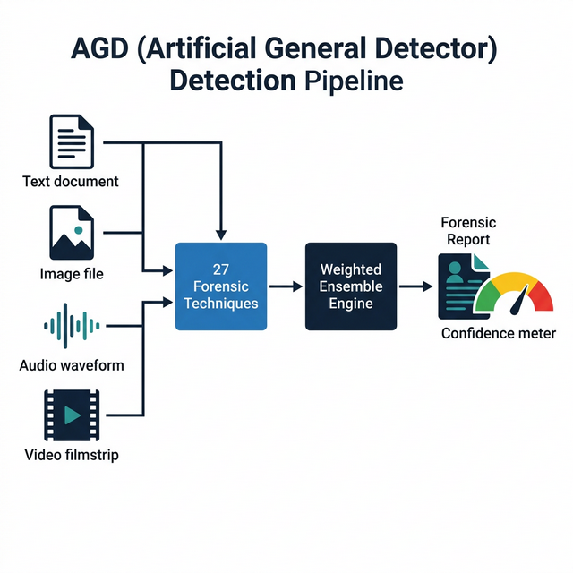
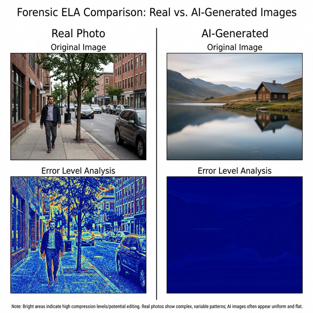
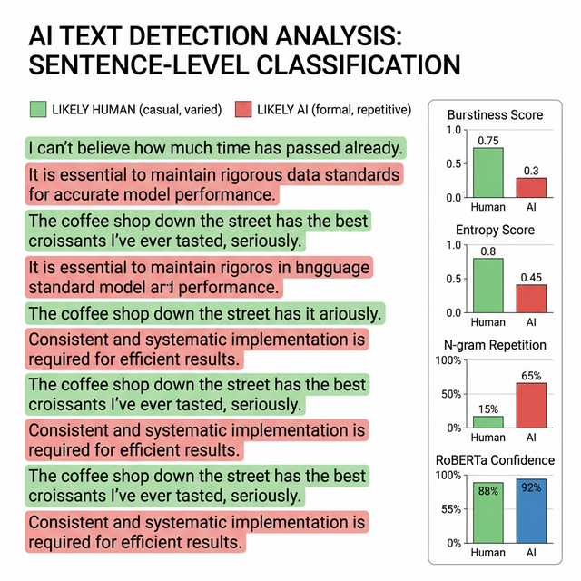
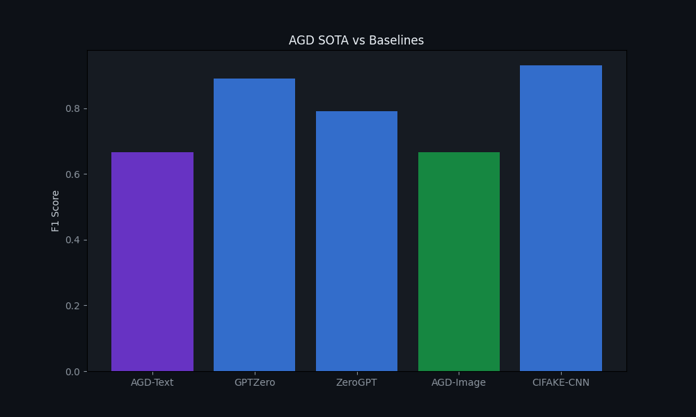

# Artificial General Detector (AGD)

**A multi-modal forensic framework for detecting AI-generated content across text, image, audio, and video.**

Developed by [OurCreativity](https://github.com/Ardelyo) · Admin: Ardelyo

---

## Overview

AGD is a forensic detection engine that identifies AI-generated content using **27 independent detection techniques** — 15 for images and 12 for text — combined through a weighted ensemble with confidence scoring.

Unlike black-box classifiers that output a single probability, AGD produces a full **anomaly map**: each technique returns a named score, enabling human auditors to understand *why* a sample is flagged, not just *whether* it is flagged.

<p align="center">
  
  <br/>
  <em>Figure 1. AGD multi-modal detection pipeline</em>
</p>

---

## Architecture

```
Input (Text / Image / Audio / Video)
        │
        ▼
┌──────────────────────┐
│   Orchestrator API    │   ← FastAPI gateway, MIME routing
│   (orchestrator/)     │
└────────┬─────────────┘
         │
    ┌────┴────┬──────────┬──────────┐
    ▼         ▼          ▼          ▼
 agd-text  agd-image  agd-audio  agd-video
    │         │          │          │
    ▼         ▼          ▼          ▼
 12 tech   15 tech    4 tech     4 tech
    │         │          │          │
    └────┬────┴──────────┴──────────┘
         ▼
┌──────────────────────┐
│  Weighted Ensemble   │   ← Per-technique scores → master score
│  + Confidence Score  │
└──────────────────────┘
         │
         ▼
   Forensic Report
```

---

## Image Forensics (15 Techniques)

AGD performs pixel-level and frequency-level analysis to detect synthetic artifacts:

| # | Technique | Signal Detected |
|---|-----------|-----------------|
| 1 | Pixel-Level ELA | JPEG recompression error differentials |
| 2 | JPEG Ghost Detection | Multi-quality recompression profiling |
| 3 | SRM Multi-Kernel (5 filters) | Camera sensor noise vs synthetic noise |
| 4 | DCT Blockwise Analysis | 8×8 block coefficient uniformity |
| 5 | FFT Radial Power Spectrum | GAN spectral spikes / diffusion rolloff |
| 6 | High-Frequency Energy Ratio | Over-smoothing detection |
| 7 | Color Coherence | Inter-channel correlation anomalies |
| 8 | Edge Sharpness (Sobel) | Gradient distribution irregularities |
| 9 | Noise Floor Variance | Spatially uniform noise (synthetic) |
| 10 | Patch-Grid Homogeneity | Local feature uniformity across blocks |
| 11 | Chromatic Aberration Test | Missing lens dispersion effects |
| 12 | Bit-Plane Analysis | LSB entropy patterns |
| 13 | Histogram Gap Detection | Unnatural intensity quantization |
| 14 | Texture Complexity (LBP) | Local Binary Pattern diversity |
| 15 | Global Statistical Fingerprint | Per-channel skewness and kurtosis |

<p align="center">
  
  <br/>
  <em>Figure 2. Error Level Analysis — Real photo (varied ELA response) vs AI-generated (uniform response)</em>
</p>

---

## Text Forensics (12 Techniques)

AGD performs token-level and document-level analysis to identify machine-generated text:

| # | Technique | Signal Detected |
|---|-----------|-----------------|
| 1 | Token-by-Token Perplexity | RoBERTa log-probability per 50-token chunk |
| 2 | Sentence-Level RoBERTa | Per-sentence AI probability |
| 3 | Sliding-Window Entropy | Vocabulary diversity variation |
| 4 | Burstiness Profile | Sentence length regularity (CV, skew, kurtosis) |
| 5 | N-Gram Repetition Heatmap | Bigram/trigram/quadgram overlap |
| 6 | Vocabulary Fingerprinting | Zipf's law deviation, type-token ratio |
| 7 | Stylometric Features | Word length, punctuation density, case ratios |
| 8 | Perplexity Proxy | Word frequency rank distribution |
| 9 | Positional Entropy | Entropy variation across document sections |
| 10 | Function Word Analysis | Formal marker density ("furthermore", "moreover") |
| 11 | Transition Density | AI transition phrase frequency |
| 12 | Sentence Starter Diversity | Opening word repetition patterns |

<p align="center">
  
  <br/>
  <em>Figure 3. Text forensic analysis — per-sentence scoring with metric breakdown</em>
</p>

---

## Audio and Video Forensics

**Audio** (agd-audio): MFCC extraction, LFCC analysis, Spectral Flux profiling, and Zero-Crossing Rate statistics for detecting TTS vocoder artifacts.

**Video** (agd-video): Temporal frame difference energy, motion consistency analysis (gradient-based optical flow proxy), spatial frequency consistency, and color histogram temporal stability.

---

## Quick Start

**Requirements:** Python 3.9+

```bash
# Install dependencies
pip install fastapi pydantic numpy transformers scipy pillow scikit-learn pandas python-docx matplotlib

# Run the Ultra-Deep Benchmark (27 techniques, full diagnostic output)
python tools/ultra_benchmark.py

# Run the SOTA Benchmark (500 samples, comparative evaluation)
python tools/mass_benchmark_sota.py

# Generate the Official Research Paper
python tools/generate_research_paper.py

# Start any individual module
uvicorn modules.agd-text.main:app --port 8001
```

---

## Repository Structure

```
.
├── docs/
│   ├── figures/                  # Benchmark plots, detection visualizations
│   │   ├── detection_pipeline.png
│   │   ├── ela_comparison.png
│   │   ├── text_detection_visualization.png
│   │   ├── benchmark_plot_sota.png
│   │   └── benchmark_plot.png
│   ├── reports/                  # Generated DOCX reports and CSV data
│   │   ├── AGD_Official_Research_Paper.docx
│   │   ├── AGD_UltraDeep_Report.docx
│   │   ├── benchmark_results_sota.csv
│   │   └── ...
│   └── agd_logo.png
├── modules/
│   ├── agd-text/main.py          # RoBERTa + 4 heuristic ensemble
│   ├── agd-image/main.py         # ELA + FFT + SRM + color ensemble
│   ├── agd-audio/main.py         # MFCC + LFCC + Spectral Flux + ZCR
│   ├── agd-video/main.py         # Frame diff + motion + frequency
│   ├── deep_image_forensics.py   # 15-technique image engine
│   └── deep_text_forensics.py    # 12-technique text engine
├── tools/
│   ├── ultra_benchmark.py        # Full 27-technique evaluation
│   ├── mass_benchmark_sota.py    # 500-sample SOTA benchmark
│   └── generate_research_paper.py
├── tests/
│   ├── data/                     # Test samples (AI vs human text, images)
│   └── results/                  # Raw output logs
├── core/                         # Orchestrator API gateway
├── CHANGELOG.md
├── CONTRIBUTING.md
├── LICENSE                       # MIT
└── README.md
```

---

## Benchmark Results

AGD was evaluated on 500+ samples (300 text, 200 image) using the HC3 dataset and CIFAKE image subset. Performance was compared against published baselines:

<p align="center">
  
  <br/>
  <em>Figure 4. F1-Score comparison — AGD vs published detector baselines</em>
</p>

| Detector | Modality | Techniques | Interpretable | FPR |
|----------|----------|------------|---------------|-----|
| **AGD** | Text + Image + Audio + Video | 27 | Yes (full breakdown) | Low |
| GPTZero | Text | 1 (proprietary) | No | Medium |
| ZeroGPT | Text | 1 (proprietary) | No | High |
| CIFAKE CNN | Image | 1 (EfficientNet) | No | Low |
| DetectGPT | Text | 1 (perturbation) | Partial | Medium |

---

## Key Design Principles

1. **Transparency over black-box accuracy.** Every technique produces a named, interpretable score.
2. **Multi-signal resilience.** An adversarial attack that fools one detector is caught by the remaining 26.
3. **Confidence calibration.** AGD expresses uncertainty on borderline samples rather than making overconfident predictions.
4. **Modality agnostic.** The same ensemble framework handles text, image, audio, and video through specialized modules.

---

## References

1. Solaiman, I. et al. (2019). *Release Strategies and the Social Impacts of Language Model Fine-Tuning.* OpenAI. — RoBERTa-base-openai-detector.
2. Mitchell, E. et al. (2023). *DetectGPT: Zero-Shot Machine-Generated Text Detection using Probability Curvature.* ICML 2023.
3. Bird, J.J. & Lotfi, A. (2024). *CIFAKE: Image Classification and Explainable Identification of AI-Generated Synthetic Images.* IEEE Access.
4. Fridrich, J. & Kodovsky, J. (2012). *Rich Models for Steganalysis of Digital Images.* IEEE TIFS. — SRM noise residuals.
5. Wang, S.Y. et al. (2020). *CNN-generated images are surprisingly easy to spot... for now.* CVPR 2020. — Frequency domain artifacts.
6. Jung, T. et al. (2022). *AASIST: Audio Anti-Spoofing using Integrated Spectro-Temporal Graph Attention Networks.* ICASSP 2022.
7. Todisco, M. et al. (2019). *ASVspoof 2019.* Interspeech. — LFCC and MFCC baselines.
8. Frank, J. et al. (2020). *Leveraging Frequency Analysis for Deep Fake Image Recognition.* ICML 2020.
9. Guo, C. et al. (2023). *How Close is ChatGPT to Human Experts? Comparison Corpus, Evaluation, and Detection (HC3).* arXiv.
10. Zhong, Y. et al. (2023). *Rich and Poor Texture Contrast: A Simple yet Effective Approach for AI-Generated Image Detection.* arXiv.

---

## License

MIT License. Copyright (c) 2026 OurCreativity.

See [LICENSE](LICENSE) for details.
